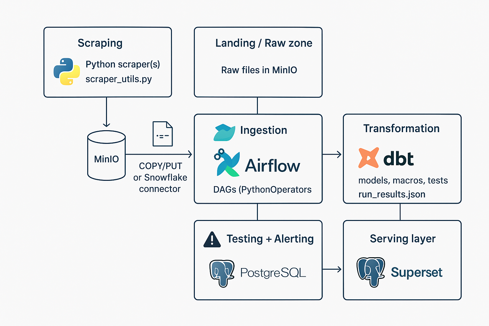

# Web Scraping & Data Pipeline Project

## 🔍 Project Overview

This project implements an end-to-end **data pipeline for web-scraped e-commerce data**. The pipeline automates the extraction, ingestion, transformation, and visualization of structured and unstructured data from multiple sources. It combines modern data engineering tools to ensure scalability, maintainability, and observability.

The system collects product, category, brand, and review data using Python scrapers, stores raw data in **MinIO**, loads it into **Snowflake** for centralized analytics, transforms it using **dbt**, and serves curated data to **PostgreSQL** for **Apache Superset** dashboards. **Apache Airflow** orchestrates all processes, ensuring reliability and automation.

## 📊 Architecture Overview

### High-Level Workflow

1. **Scraping Layer**: Python scrapers collect e-commerce data (products, prices, reviews, categories) in JSON/Parquet format.
2. **Landing/Raw Zone**: Raw data files are uploaded to MinIO (S3-compatible) for storage.
3. **Ingestion Layer**: Airflow DAGs load raw files from MinIO to Snowflake staging tables using the Snowflake Python connector.
4. **Transformation Layer**: dbt models clean, normalize, and aggregate data into business-ready marts.
5. **Testing & Alerting**: dbt tests are triggered via Airflow; failed tests trigger alert notifications.
6. **Serving Layer**: Transformed data is pushed to PostgreSQL and visualized in Superset for BI dashboards.

## 🛠️ Technologies Used

### **Data Collection**

* **Python (requests, BeautifulSoup, or Scrapy)** – for scraping static and dynamic web data.

### **Storage & Processing**

* **MinIO** – raw/landing zone storage (S3-compatible).
* **Snowflake** – main data warehouse for structured data and analytics.
* **PostgreSQL** – serves as the BI and reporting database.

### **Orchestration & Transformation**

* **Apache Airflow** – orchestrates scraping, ingestion, and transformation tasks.
* **dbt (Data Build Tool)** – transforms and tests data within Snowflake.

### **Visualization & Reporting**

* **Apache Superset** – used for dashboarding and data exploration.

### **Containerization & Deployment**

* **Docker & Docker Compose** – all services are containerized for consistent local and production environments.

## 🛠️ Tools Summary

| Layer              | Tool                          | Purpose                                   |
| ------------------ | ----------------------------- | ----------------------------------------- |
| Scraping           | Python                        | Extracts raw data from websites           |
| Storage            | MinIO                         | Stores raw JSON/Parquet files             |
| Ingestion          | Airflow + Snowflake Connector | Loads data into Snowflake staging         |
| Transformation     | dbt                           | Cleans and models data                    |
| Testing & Alerting | dbt + Airflow                 | Validates data and triggers notifications |
| Serving            | PostgreSQL                    | Stores transformed datasets for BI        |
| Visualization      | Apache Superset               | Dashboards and analytics                  |

## 🚀 Pipeline Architecture

See the visual architecture diagram in the project 




## 🔗 Project Structure

```
├── dags/                      # Airflow DAGs
│   ├── scrape_to_minio_dag.py
│   ├── load_to_snowflake_dag.py
│   ├── transform_dbt_dag.py
│   └── test_and_alert_dag.py
├── dbt/                       # dbt project folder
│   ├── models/
│   ├── macros/
│   └── tests/
├── scripts/                   # Python scrapers & ingestion utilities
│   ├── scraper_utils.py
│   ├── upload_to_minio.py
│   └── minio_snowflake_loader.py
├── docker-compose.yml          # Docker services definition
├── Dockerfile                  # Custom image for scraper/ingestion
├── requirements.txt            # Python dependencies
├── README.md                   # This file
└── .gitignore                  # Git ignored files
```

## 📅 Current Progress (As of November 2025)

✅ Dockerized Infrastructure (MinIO, PostgreSQL, Airflow, dbt, Superset)

✅ Scraping Framework (scraper_utils.py) for multiple data sources

✅ Airflow DAGs for ingestion and transformation

✅ dbt models for product and review transformation

✅ Alerting system integrated with dbt test results

## 🔄 Next Steps

* Implement real alert notifications via Slack or email in Airflow.
* Add metadata tracking (data freshness, record counts) to Airflow logs.
* Extend scrapers to handle multi-language and multi-region product listings.
* Optimize dbt performance and add incremental models.
* Automate Superset dashboard refresh after dbt runs.

## 🖼️ GitHub Repository

**Repository:** [https://github.com/marwenmejri/OpenCommerce-Data-Platform](https://github.com/marwenmejri/OpenCommerce-Data-Platform)

Maintained by **Marwen Mejri – Senior Data Engineer**

"From web to warehouse – automated, reliable, and production-ready."
